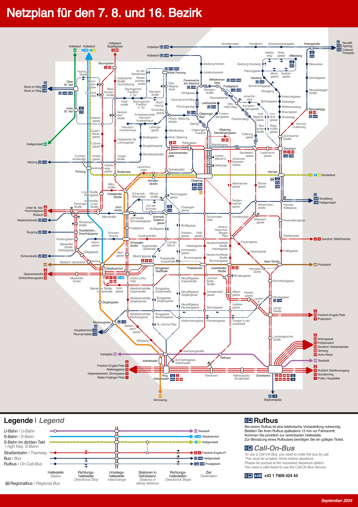

# Plan Landstraße-Simmering

Hierbei handelt es sich um einen erstellten Netzplan für Neubau, die Josefstadt und Ottakring, der 7., 8. beziehungsweise 16. Bezirk von Wien.

Dabei sind alle Linien im Bezirk, sowie darüber hinausgehend relevante Verbindungen eingezeichnet.

## Links zur Web-View

### Aktueller Plan (Stand 02. September 2024)
#### Dieser Plan beinhaltet:
 * Wiedereröffnete Linie U2 zwischen Schottentor und Karlsplatz *- ab 02. September 2024*
 * Wiedereröffnete Linie 43 zwischen Schottentor und Alser Straße *- ab 02. September 2024*
 * Wiedereröffnung der Linie 44 *- ab 02. September 2024*
 * Regellinienführung der Linie 33 *- ab 02. September 2024*

#### Links
 * [PNG](https://raw.githubusercontent.com/T-DogCodes/plans-16_Ottakring/main/v24.09/Plan_16_Ottakring.v24.09.0.big.png)
 * [PDF](https://raw.githubusercontent.com/T-DogCodes/plans-16_Ottakring/main/v24.09/Plan_16_Ottakring.v24.09.0.pdf)

## Andere Pläne:
 * [2. und 20. Bezirk](https://github.com/T-DogCodes/plans-2_20_Leopldstadt_Brigittenau)
 * [3. und 11. Bezirk](https://github.com/T-DogCodes/plans-3_11_Landstrasse_Simmering)

## Vorschaubild

Satz und Druckfehler vorbehalten

Dieser Plan steht in keiner Verbindung zu Wiener Linien